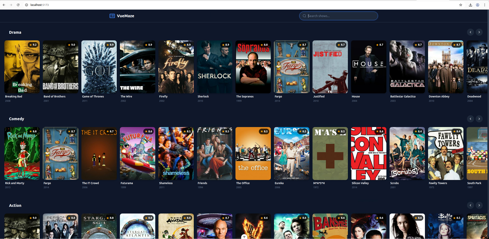
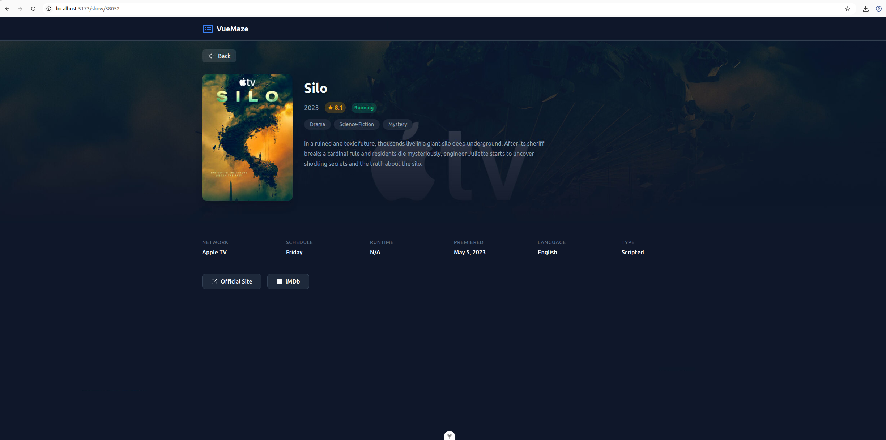
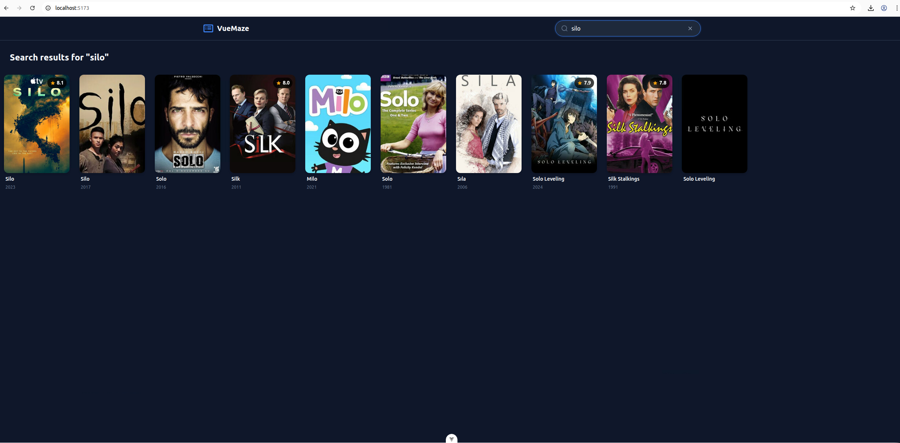
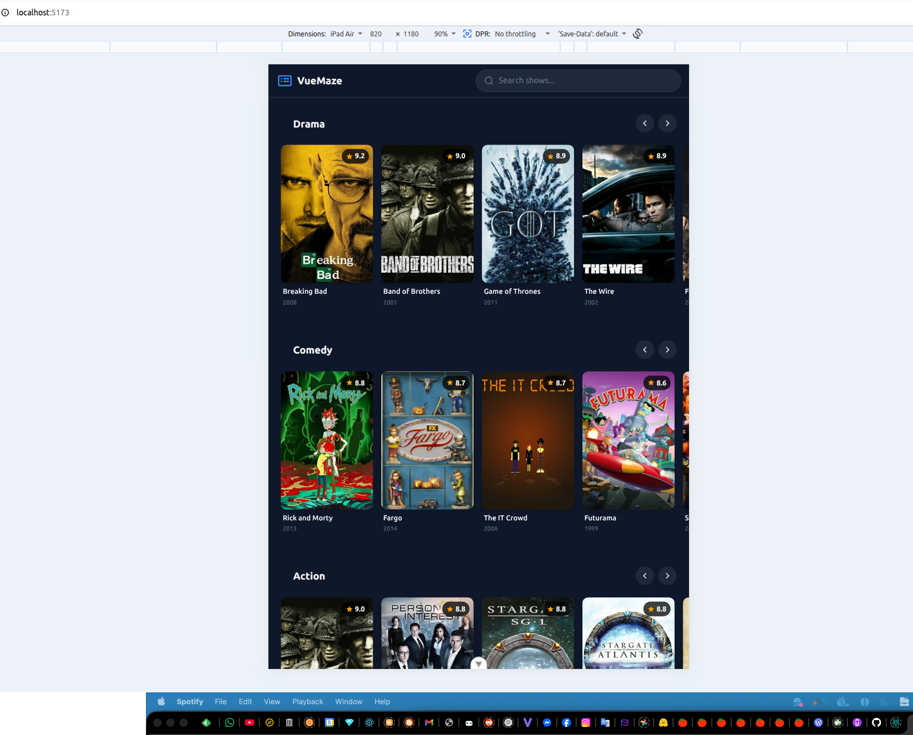
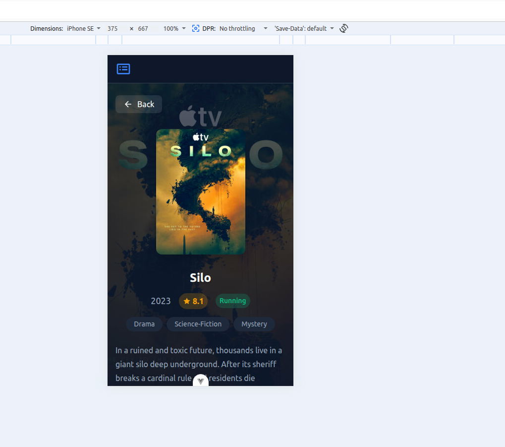

# VueMaze - TV Show Dashboard

A Vue.js TV show dashboard application that displays TV shows categorized by genre, with search functionality and detailed show information pages. Built as part of the ABN AMRO Frontend Developer assessment.


## 🎯 Features

- **Dashboard View**: Browse TV shows organized by genre in horizontal scrollable rows
- **Genre-based Organization**: Shows are grouped by genre (Drama, Comedy, Action, etc.) and sorted by rating
- **Show Details**: Comprehensive show information including poster, rating, summary, schedule, and external links
- **Search**: Real-time search with debouncing to find shows by name
- **Responsive Design**: Mobile-friendly layout that adapts to all screen sizes
- **Dark Theme**: Modern streaming-app inspired dark theme

## � Screenshots

### Dashboard - Desktop View


### Show Details - Desktop View


### Search Results


### Mobile Views
| Dashboard | Show Details |
|-----------|--------------|
|  |  |

## �🛠 Tech Stack

| Technology | Version | Purpose |
|------------|---------|---------|
| **Vue.js** | 3.5.x | Frontend framework (Composition API) |
| **TypeScript** | 6.0.x | Type safety and better developer experience |
| **Vite** | 8.0.x | Build tool and development server |
| **Vue Router** | 5.0.x | Client-side routing |
| **Vitest** | 4.1.x | Unit and component testing |
| **Vue Test Utils** | 2.4.x | Vue component testing utilities |

## 📋 Prerequisites

- **Node.js**: v20.19.0 or v22.12.0+ (v22.22.2 recommended)
- **npm**: v10.2.4 or higher

> **Note**: This project uses Node.js 22 features. If you're using nvm, run:
> ```bash
> nvm install 22
> nvm use 22
> ```

## 🚀 Getting Started

### Installation

```bash
# Clone the repository
git clone https://github.com/whiteadi/vuemaze.git
cd vuemaze

# Install dependencies
npm install
```

### Development

```bash
# Start development server
npm run dev
```

The application will be available at `http://localhost:5173`

### Build

```bash
# Type-check and build for production
npm run build

# Preview production build
npm run preview
```

### Testing

```bash
# Run unit tests
npm run test:unit

# Run tests in watch mode
npm run test:unit -- --watch

# Run tests with coverage
npm run test:unit -- --coverage
```

### Linting & Formatting

```bash
# Lint and fix
npm run lint

# Format code
npm run format
```

## 📁 Project Structure

```
vuemaze/
├── src/
│   ├── assets/              # Global styles
│   │   ├── main.css         # Global CSS reset and utilities
│   │   └── variables.css    # CSS custom properties (design tokens)
│   ├── components/          # Reusable Vue components
│   │   ├── common/          # Generic UI components
│   │   │   ├── AppHeader.vue
│   │   │   ├── ErrorMessage.vue
│   │   │   └── LoadingSpinner.vue
│   │   ├── shows/           # Show-specific components
│   │   │   ├── GenreRow.vue
│   │   │   └── ShowCard.vue
│   │   └── __tests__/       # Component tests
│   ├── composables/         # Vue composition functions
│   │   ├── useDebounce.ts   # Debounce utility
│   │   ├── useSearch.ts     # Search functionality
│   │   ├── useShows.ts      # Shows data management
│   │   └── __tests__/       # Composable tests
│   ├── router/              # Vue Router configuration
│   ├── services/            # API services
│   │   ├── tvmazeApi.ts     # TVMaze API client
│   │   └── __tests__/       # Service tests
│   ├── types/               # TypeScript interfaces
│   │   └── show.ts          # Show data types
│   ├── views/               # Page components
│   │   ├── DashboardView.vue
│   │   └── ShowDetailView.vue
│   ├── App.vue              # Root component
│   └── main.ts              # Application entry point
├── CHANGELOG.md             # Version history
├── PLAN.md                  # Implementation plan
└── README.md                # This file
```

## 🎨 Architectural Decisions

### Why Vue 3 with Composition API?

- **Assignment Requirement**: ABN AMRO specifically uses Vue.js
- **Composition API**: Better TypeScript support, more flexible code organization, and easier testing
- **Script Setup**: Cleaner syntax with less boilerplate

### Why No CSS Framework (Tailwind/Bootstrap)?

1. **Demonstrates CSS Skills**: The assignment asks to see "your own creation" with minimal scaffolding
2. **CSS Custom Properties**: Used for theming, providing the same benefits as CSS-in-JS solutions
3. **Smaller Bundle Size**: No framework overhead
4. **Better Control**: Full control over styles and animations

### Why No State Management Library (Pinia/Vuex)?

- **Scope Appropriate**: For this application's complexity, Vue's built-in reactivity (ref/reactive) is sufficient
- **Composables Pattern**: The `useShows` composable provides centralized data management with caching
- **Avoid Over-engineering**: Adding Pinia would add complexity without significant benefit for this scope

### Why Custom API Service Instead of Axios?

- **Native Fetch**: Modern browsers support fetch natively
- **No External Dependencies**: Reduces bundle size
- **Type Safety**: Custom service provides proper TypeScript types
- **Error Handling**: Centralized error handling with custom ApiError class

### Component Architecture

- **Atomic Design Principles**: Components are organized from small (ShowCard) to large (Views)
- **Single Responsibility**: Each component has one clear purpose
- **Props Down, Events Up**: Standard Vue data flow pattern
- **BEM Naming**: CSS classes follow BEM methodology for clarity

## 🔌 API Integration

This application uses the [TVMaze API](https://www.tvmaze.com/api):

| Endpoint | Description |
|----------|-------------|
| `GET /shows?page={page}` | Paginated list of shows (250 per page) |
| `GET /shows/{id}` | Single show details |
| `GET /search/shows?q={query}` | Search shows by name |

### Data Processing

1. Fetch ~750 shows from first 3 pages
2. Group shows by genre (a show can appear in multiple genres)
3. Sort each genre by rating (highest first)
4. Display top 20 shows per genre

## ✅ Quality Checklist

- [x] No console errors
- [x] Responsive on mobile/tablet/desktop
- [x] TypeScript strict mode enabled
- [x] 43 unit and component tests passing
- [x] ESLint + Prettier configured
- [x] Accessible (keyboard navigation, ARIA labels)
- [x] Clean git history with meaningful commits

## 🚧 Future Improvements

- Add E2E tests with Cypress or Playwright
- Implement show favorites with local storage
- Add infinite scroll for more shows
- Implement skeleton loading states
- Add PWA support for offline access
- Implement image lazy loading with intersection observer
- Add i18n support for multiple languages

## 📝 Commit History

```
feat: initial project setup with Vue 3 + TypeScript
feat: add dashboard components and genre-based layout  
feat: add show detail page with comprehensive information
test: add unit tests for composables and API service
test: add ShowCard component tests
docs: add comprehensive README with documentation
```

## 📄 License

This project is created for the ABN AMRO Frontend Developer assessment.

---

Built with ❤️ using Vue.js